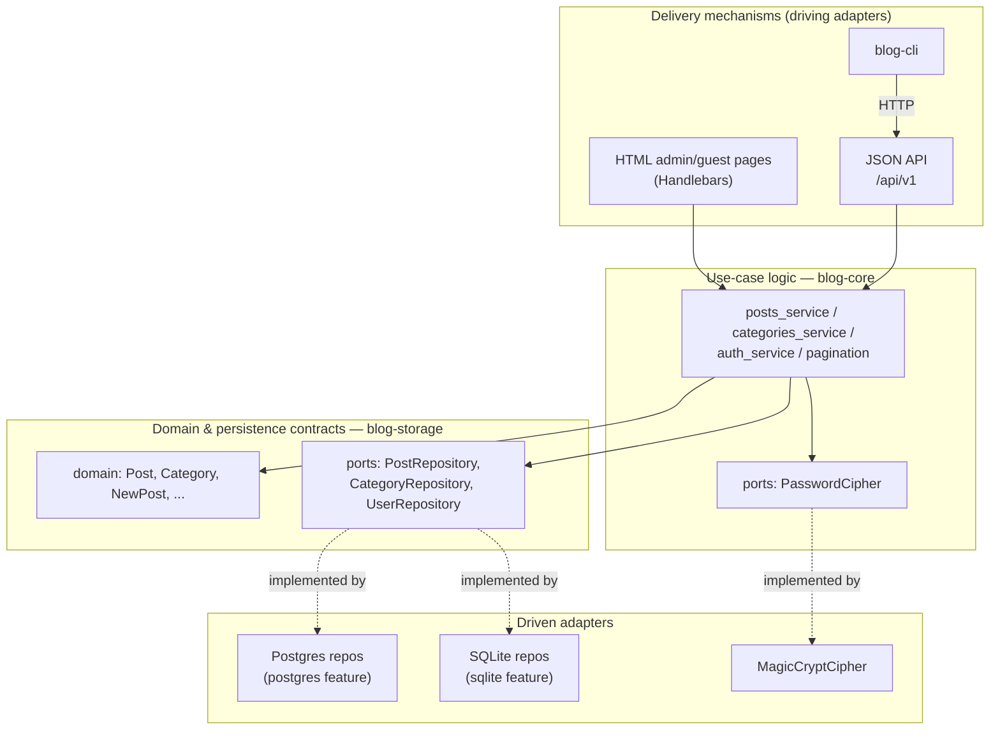
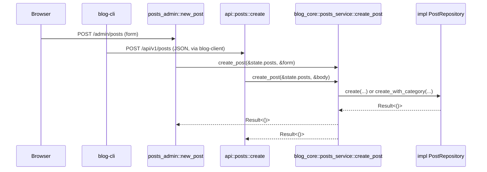
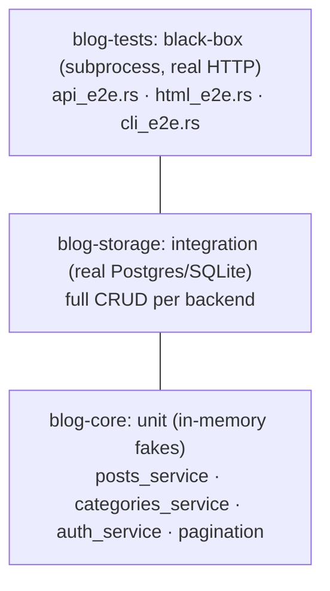

# Architecture

## Table of contents

1. [System overview](#system-overview)
2. [Architectural style](#architectural-style)
3. [Layered view](#layered-view)
4. [Crate responsibilities](#crate-responsibilities)
5. [The port pattern](#the-port-pattern)
6. [Composition root](#composition-root)
7. [Request flow](#request-flow)
8. [Database backend strategy](#database-backend-strategy)
9. [Authentication & session model](#authentication--session-model)
10. [Error handling strategy](#error-handling-strategy)
11. [Testing strategy](#testing-strategy)
12. [CI pipeline](#ci-pipeline)
13. [Deployment architecture](#deployment-architecture)
14. [Key design decisions](#key-design-decisions)
15. [Known limitations & technical debt](#known-limitations--technical-debt)

---

## System overview

| | |
|---|---|
| **Language / runtime** | Rust, async via Tokio |
| **HTTP framework** | Actix-web 4 |
| **Persistence** | PostgreSQL or SQLite, via `sqlx` — chosen at compile time, not runtime |
| **Templating** | Handlebars (server-rendered HTML) |
| **Session auth** | Cookie-based, `actix-identity` + `actix-session` |
| **Client surfaces** | Server-rendered HTML, a JSON API (`/api/v1`), a typed Rust client, a CLI |
| **Build unit** | A single Cargo workspace, seven member crates |
| **Deployment** | Docker (multi-stage build), `docker-compose` for local orchestration |

The system serves three surfaces off one core: a browser-facing admin/guest HTML app, a JSON API
for programmatic access, and a CLI (`blog-cli`) built on a typed client (`blog-client`) that talks
to the JSON API. All three are thin delivery mechanisms over the same use-case logic.

## Architectural style

The codebase follows **hexagonal architecture** (Alistair Cockburn's "ports & adapters"), applied
via Rust's trait system and Cargo's crate boundaries rather than as a naming convention layered
onto an otherwise-conventional MVC app. The governing rule is the **Dependency Inversion
Principle**: business logic defines the interfaces it needs (*ports*), and infrastructure code
(databases, HTTP frameworks, template engines) implements them (*adapters*) — never the other way
around.

Concretely, this means:

- `blog-core` (use-case logic) and `blog-storage`'s domain types have **zero compile-time
  dependency** on Actix-web, a concrete `sqlx` backend, or Handlebars. `cargo tree -p blog-core`
  shows no trace of any of them.
- Swapping the database backend, or adding a new HTTP surface, never requires touching the
  business logic — only writing a new adapter that satisfies an existing port.
- The business logic is testable in isolation, in-process, without a database, an HTTP server, or
  any I/O at all (see [Testing strategy](#testing-strategy)).

This is deliberate over the simpler alternative (a single crate, a `DbPool` enum branching on
backend at runtime, services taking `web::Data<PgPool>` directly) — see
[Key design decisions](#key-design-decisions) for the trade-off this buys.

## Layered view



Arrows into a *ports* box are **dependencies**; dashed arrows are **implementations**, running the
opposite direction. `blog-core` depends on the storage ports, never on a concrete `Pg*`/`Sqlite*`
type — those are wired in only at the composition root.

## Crate responsibilities

| Crate | Role | Depends on |
|---|---|---|
| `blog-server` | Composition root + HTTP delivery. Wires concrete adapters to ports, starts Actix, hosts every HTTP handler. | `blog-core`, `blog-storage`, `blog-views` |
| `blog-core` | Use-case logic: post/category/auth workflows, pagination rules. Mechanism-agnostic — no HTTP, no SQL. | `blog-storage` (domain types + ports only) |
| `blog-storage` | Domain types, repository ports, and the only two implementations of them (Postgres, SQLite), gated by Cargo features. Owns migrations. | *(leaf crate)* |
| `blog-views` | Bundles Handlebars templates and static assets; exposes `register()` and a runtime-overridable root path. | *(leaf crate)* |
| `blog-client` | Typed async `reqwest` client for the `/api/v1` JSON API, including cookie-session management. | *(leaf crate, talks to `blog-server` only over HTTP)* |
| `blog-cli` | `clap`-based CLI, session persisted to disk between invocations. | `blog-client` |
| `blog-tests` | Black-box tests: builds and runs the real `blog-server`/`blog-cli` binaries as subprocesses, drives them over HTTP. | `blog-client` (+ builds the other two binaries via `escargot`) |

`blog-client`/`blog-cli`/`blog-tests` never depend on `blog-server`, `blog-core`, or `blog-storage`
directly — they only ever speak HTTP to a running server, exactly as an external caller would.

## The port pattern

A port is a trait the logic layer defines and depends on; a different, outer layer implements it.
There are two ports in this system:

**`blog_storage::ports`** — `PostRepository`, `CategoryRepository`, `UserRepository`. Defined in
`blog-storage` alongside the domain types they operate on, implemented twice in the same crate
(`postgres::Pg*Repository`, `sqlite::Sqlite*Repository`), each gated behind its own Cargo feature.
`blog-core` depends on the trait only:

```rust
// blog-core/src/posts_service.rs
pub async fn create_post(repo: &impl PostRepository, new_post: &NewPost) -> Result<()> {
    if new_post.category_id == 0 {
        repo.create(new_post).await?;
    } else {
        repo.create_with_category(new_post, new_post.category_id).await?;
    }
    Ok(())
}
```

`repo` is generic (`impl PostRepository`, monomorphized at compile time — not `dyn PostRepository`,
since the concrete type is always known at the call site). This function has no idea whether
`repo` is backed by Postgres, SQLite, or an in-memory `Vec` in a test.

**`blog_core::ports::PasswordCipher`** — defined in `blog-core`, implemented by `MagicCryptCipher`
in `blog-server`'s `adapters/crypto/`. A one-method port (`encrypt(&self, plain: &str) -> String`)
used by `auth_service` to hash-then-compare credentials without knowing anything about the
`magic-crypt` crate.

A third implementation of the storage ports exists purely for tests:
`blog-core/src/test_fakes.rs` provides `InMemoryPostRepository`/`InMemoryCategoryRepository`/
`InMemoryUserRepository` (`Mutex`-guarded `Vec`s) plus a `FakeCipher`, `#[cfg(test)]`-gated so they
never ship in a release build. This is what lets `blog-core`'s branching logic be unit-tested in
milliseconds — see [Testing strategy](#testing-strategy).

## Composition root

`blog-server/src/main.rs` (the `blog-server` binary) is the one place the abstraction is resolved: it reads
configuration, connects to whichever backend was compiled in, and constructs the concrete
`AppState`:

```rust
// blog-server/src/adapters/http/state.rs (abridged)
#[cfg(feature = "postgres")]
use blog_storage::postgres::{PgCategoryRepository as Categories, PgPostRepository as Posts, ...};
#[cfg(feature = "sqlite")]
use blog_storage::sqlite::{SqliteCategoryRepository as Categories, SqlitePostRepository as Posts, ...};

pub struct AppState {
    pub posts: Posts,
    pub categories: Categories,
    pub users: Users,
    pub cipher: MagicCryptCipher,
}
```

`Posts`/`Categories`/`Users` resolve to exactly one concrete type per build — never an enum, never
a `Box<dyn Trait>`. Every HTTP handler receives this `AppState` via Actix's `web::Data<T>` and
calls straight into `blog-core`, passing `&state.posts` etc. as the `impl PostRepository`.

`main.rs` also owns the workspace's one runtime invariant that can't be expressed in the type
system: `blog-server` must be built with **exactly one** of the `postgres`/`sqlite` features.
`blog-storage` itself compiles fine with zero, one, or both (so its own test suite can exercise
both backends), but the binary enforces the choice with a `compile_error!`:

```rust
#[cfg(all(feature = "postgres", feature = "sqlite"))]
compile_error!("enable exactly one of the `postgres` or `sqlite` features, not both");
#[cfg(not(any(feature = "postgres", feature = "sqlite")))]
compile_error!("enable one of the `postgres` or `sqlite` features (`postgres` is the default)");
```

## Request flow

"Create a post" exists on all three delivery surfaces at once, which makes it a useful trace
through every layer:



Both the HTML form handler ([`posts_admin.rs::new_post`](blog-server/src/adapters/http/posts_admin.rs)) and the
JSON API handler ([`api/posts.rs::create`](blog-server/src/adapters/http/api/posts.rs)) perform the same login
check (`require_login`) and the same form/body validation, then call the identical `blog-core`
function. `blog-cli`'s `post create` subcommand is one more hop upstream of the JSON path — it
goes through `blog-client`, which just wraps the `/api/v1/posts` HTTP call.

Written out as two separate traces, end to end:

**HTTP → DB** (a browser or any JSON API caller, hitting `blog-server` directly):

```
HTTP request
  → blog-server (adapter: checks login, validates)
    → blog-core (business logic: e.g. "does this post have a category?")
      → a PostRepository trait call (blog-core doesn't know which backend)
        → whichever concrete repo got compiled in: PgPostRepository OR SqlitePostRepository
          → the actual database
```

**CLI → DB** (`blog-cli`, which never talks to `blog-core` or the database directly — it's just
another HTTP caller, one hop further out):

```
blog-cli command (e.g. `post create`)
  → blog-client (builds the HTTP request, attaches the session cookie)
    → HTTP request to blog-server's /api/v1/... (the exact same entry point any HTTP caller uses)
      → blog-server (adapter: checks login, validates)
        → blog-core (business logic: e.g. "does this post have a category?")
          → a PostRepository trait call (blog-core doesn't know which backend)
            → whichever concrete repo got compiled in: PgPostRepository OR SqlitePostRepository
              → the actual database
```

Everything below `blog-server` in both traces is identical — `blog-cli` only adds two hops
(`blog-client`, then a real HTTP request) *before* reaching the same adapter layer every other
caller goes through. There is no `blog-cli`-specific code path inside `blog-core`/`blog-storage`
at all.

`create_post` itself is the only place the "does this post have a category" branch lives:

```rust
if new_post.category_id == 0 {
    repo.create(new_post).await?;
} else {
    repo.create_with_category(new_post, new_post.category_id).await?;
}
```

`repo` resolves to `PgPostRepository` or `SqlitePostRepository` at compile time — the branch above
is the *only* branch in this entire flow; which database backend is running is never a runtime
decision anywhere in the call stack.

## Database backend strategy

`blog-storage` implements its three repository ports twice, gated behind Cargo features:

```toml
# blog-storage/Cargo.toml
[features]
postgres = ["sqlx/postgres"]
sqlite   = ["sqlx/sqlite"]
```

`blog-server`'s own `postgres`/`sqlite` features just forward to these. This is **deliberately not
a runtime `DbPool` enum** (`enum DbPool { Postgres(PgPool), Sqlite(SqlitePool) }`) — see
[Key design decisions](#key-design-decisions) for why.

Migrations live under `blog-storage/migrations/{postgres,sqlite}/`, embedded into the binary at
compile time via `sqlx::migrate!`, and are applied automatically on every `AppState::connect(...)`
call — including in production — so there is no separate manual migration step to forget:

```rust
// blog-storage/src/postgres/mod.rs
pub async fn migrate(pool: &Pool<Postgres>) -> Result<()> {
    sqlx::migrate!("./migrations/postgres").run(pool).await?;
    Ok(())
}
```

This is idempotent (already-applied migrations are skipped), which is what makes it safe to run
unconditionally on every process start, including every container restart.

## Authentication & session model

Sessions are cookie-based via `actix-identity` + `actix-session`, with an in-memory-signed cookie
store (`CookieSessionStore`) — no server-side session table. `Identity::login(...)` on successful
authentication ([`auth.rs::login`](blog-server/src/adapters/http/auth.rs)) sets the cookie; every subsequent
request extracts an `Option<Identity>` to determine whether a caller is authenticated.

Both the HTML admin surface and the JSON API enforce login the same way — a guard function checked
at the top of every mutating or admin-only handler:

```rust
// blog-server/src/adapters/http/auth_guard.rs
pub fn require_login(user: &Option<Identity>) -> Option<HttpResponse> {
    if user.is_some() { return None; }
    Some(HttpResponse::SeeOther().insert_header((LOCATION, "/")).body(""))
}
```

The JSON API's equivalent ([`api/mod.rs::require_login`](blog-server/src/adapters/http/api/mod.rs)) returns a
`401` JSON body instead of a redirect — same guarantee, shaped for its caller.

The session cookie's `Secure` flag is on by default and only disabled under the
`cors_for_local_development` feature, since a plain-`http://` client (including `blog-client`
during local testing) won't send a `Secure` cookie back over an unencrypted connection.

> **Note:** every mutating admin HTML handler (`new_post`, `update_post`, `destroy_post`,
> `create_category`, `update_category`, `destroy_category`, plus the GET handlers `edit_post` and
> `show_post`) was, until a recent fix, missing this guard entirely — the JSON API always enforced
> it correctly, but the HTML form handlers didn't. This was caught by
> [`blog-tests/tests/html_e2e.rs`](blog-tests/tests/html_e2e.rs), which now asserts every admin
> route rejects unauthenticated requests.

## Error handling strategy

Each library crate defines its own error type via `thiserror` instead of returning an opaque
`anyhow::Error`:

| Crate | Error type | Wraps |
|---|---|---|
| `blog-storage` | `StorageError` | `sqlx::Error`, `sqlx::migrate::MigrateError` |
| `blog-core` | `CoreError` | `StorageError` |
| `blog-views` | `ViewsError` | `Box<handlebars::TemplateError>` (boxed — `clippy::result_large_err`) |
| `blog-client` | `ClientError` | Distinguishes `NotAuthenticated` / `InvalidCredentials` / `NotFound` / network / generic API errors — see [`blog-client/src/error.rs`](blog-client/src/error.rs) |

`anyhow` is kept only at the two composition roots — `blog-server`'s [`src/main.rs`](blog-server/src/main.rs)
and `blog-cli`'s [`blog-cli/src/main.rs`](blog-cli/src/main.rs). This follows the conventional
Rust split: `thiserror` for libraries whose callers might want to match on *why* something failed,
`anyhow` for binaries whose `main` just needs to print an error and exit. It works without any
glue code because `anyhow::Error` has a blanket `impl<E: std::error::Error> From<E>`, so `?` in
`main` picks up any of the four custom types automatically.

The HTTP adapter layer required **no changes** to support this design:
`actix_web::error::ErrorInternalServerError` is generic over any `Debug + Display` error, not
`anyhow` specifically, so `.map_err(actix_web::error::ErrorInternalServerError)?` continued to
compile unchanged across every one of the ~60 call sites in `blog-server/src/adapters/http/`.

## Testing strategy

The test suite is a pyramid, deliberately shaped so most of it runs in milliseconds:



| Layer | What it proves | How | Speed |
|---|---|---|---|
| **Unit** (`blog-core`) | Business-logic branching is correct — which repository call `update_post` makes, when a page resolves to `None`, auth success/failure. | `#[cfg(test)]` in-memory fakes (`test_fakes.rs`) implementing the storage ports. `proptest` additionally fuzzes `pagination.rs` across the full `i64` range. | Sub-millisecond, no I/O. |
| **Integration** (`blog-storage`) | Each repository's SQL is actually correct against a real engine. | Real Postgres/SQLite, migrations run fresh. Postgres tests each get their own schema (`CREATE SCHEMA` + `search_path`, applied via `after_connect` so it's consistent across every pooled connection) — no shared table, so they run in parallel with no `--test-threads=1`. SQLite tests each get their own temp file. | Milliseconds–low seconds. |
| **Black-box** (`blog-tests`) | The pieces actually work wired together — bind address, cookie/CORS settings, route paths, CLI argument parsing, login enforcement. | Builds the real `blog-server`/`blog-cli` binaries (via `escargot`, since they're separate crates) and runs them as subprocesses against a scratch SQLite database on an ephemeral port. Drives them over real HTTP: `api_e2e.rs` via `blog-client`, `html_e2e.rs` via raw `reqwest` with a cookie jar and redirects disabled (to assert each hop), `cli_e2e.rs` via `assert_cmd` against the compiled CLI, asserting on stdout. | Seconds (dominated by the subprocess builds/boots). |

The black-box layer is what caught the missing-`require_login` bug described in
[Authentication & session model](#authentication--session-model) — a class of defect that unit
tests structurally cannot see, since it's about whether routes are *wired* correctly, not whether
any individual function is correct in isolation.

## CI pipeline

`.github/workflows/rust.yml` runs on every push/PR to `main`:

| Job | Purpose |
|---|---|
| `fmt` | `cargo fmt --check` |
| `clippy` | Every crate, across every relevant feature combination (`blog-storage`/`blog-server` built both as `postgres` and as `sqlite`), `-D warnings` |
| `test-sqlite` | `blog-storage`/`blog-server` built and tested against SQLite — no external service needed |
| `test-postgres` | Same, against a real Postgres service container |
| `test-core-and-views` | `blog-core`/`blog-views` unit + integration tests |
| `test-client-cli` | `blog-client`/`blog-cli` unit tests |
| `test-e2e` | `blog-tests`' full black-box suite — no external services needed, since it provisions its own scratch SQLite database per test |

## Deployment architecture

`Dockerfile` is a two-stage build:

1. **Builder** (`rust:latest`) — compiles the `blog-server` release binary with whichever
   `DB_BACKEND` build arg was passed (`postgres` by default).
2. **Runtime** (`debian:bookworm-slim`) — just the compiled binary, `ca-certificates`, and
   `blog-views`' templates directory, copied in.

Two environment variables exist specifically to decouple the compiled binary from the environment
it was built in, since a container's runtime filesystem/network layout isn't the same as the
builder stage's:

- **`BIND_ADDR`** — defaults to `127.0.0.1:8080` (correct for `cargo run`); `docker-compose.yml`
  overrides it to `0.0.0.0:8080` so the port Docker publishes is actually reachable from outside
  the container.
- **`BLOG_VIEWS_ROOT`** — `blog-views::ROOT` is a `concat!(env!("CARGO_MANIFEST_DIR"), ...)`
  constant, correct only inside the builder stage. The runtime image sets this env var to
  `/app/templates`, where the Dockerfile actually copies the templates, overriding the
  compile-time path at startup.

`docker-compose.yml` wires the `web` service to a `postgres:15` `db` service with a healthcheck
gate, so `web` doesn't start accepting traffic until Postgres is actually ready. `blog-server`'s
auto-migration-on-connect (see [Database backend strategy](#database-backend-strategy)) means
there's no separate migrate step in the compose flow at all — `docker compose up -d --build` is
sufficient to get a fully migrated, running stack.

## Key design decisions

| Decision | Rationale | Trade-off accepted |
|---|---|---|
| Compile-time DB backend (Cargo features) over a runtime `DbPool` enum | One concrete, monomorphic repository type per build; no call site pattern-matches or forwards through a wrapper; unused backend's dependencies aren't even compiled in. | Switching backends means rebuilding, not flipping a config value at runtime — a deliberate constraint, not an oversight. |
| `impl PostRepository` (generic, monomorphized) over `dyn PostRepository` | No vtable indirection; the concrete type is always known at every call site in this codebase. | Would need to change if the app ever needed to hold a heterogeneous collection of repositories at runtime — not a need this app has. |
| `thiserror` in libraries, `anyhow` only in binaries | Library callers can match on *why* something failed; binaries just need to print and exit. Required zero downstream changes since both `anyhow::Error` and `actix_web::ErrorInternalServerError` accept anything implementing `std::error::Error`/`Debug + Display`. | Four small error enums to maintain instead of one opaque type — worth it for the two crates (`blog-client`, potentially others) whose callers actually branch on error kind today. |
| Session auth via signed cookies, not server-side sessions | No session-store infrastructure (Redis, a sessions table) to run or fail. | Session data (just a username) has to fit in a cookie, and revocation-on-demand isn't possible without a server-side check — acceptable for this app's scope. |
| One workspace, seven crates | Enforces the dependency-direction rules in [Layered view](#layered-view) at the compiler level — `blog-core` *cannot* accidentally import Actix-web, because it isn't a dependency. | More `Cargo.toml` files and crate boundaries to navigate than a single-crate app. |
| Black-box tests build real binaries via subprocess, not `TestApp` in-process helpers | Genuinely exercises the compiled binary — bind address, feature flags, CLI argument parsing — not just the library code behind it. | Slower per-test (a `cargo build` the first time, then subprocess boot) than an in-process Actix test server would be. |

## Known limitations & technical debt

Documented deliberately rather than silently — these are known trade-offs or gaps, not hidden
surprises:

- **Passwords are encrypted, not hashed.** `MagicCryptCipher` ([`adapters/crypto/mod.rs`](blog-server/src/adapters/crypto/mod.rs))
  uses `magic-crypt`, which is *reversible* symmetric encryption, not a one-way password hash. If
  `MAGIC_KEY` is ever exposed, every stored password is trivially recoverable in plaintext, and the
  scheme lacks the deliberate slowness (bcrypt/argon2) that defends a stolen database against
  brute-forcing. This is the most significant open item in the system.
- **`RUST_LOG` is hardcoded** in [`src/main.rs`](blog-server/src/main.rs) via `std::env::set_var("RUST_LOG",
  "debug")`, unconditionally overriding whatever the operator sets — `docker-compose.yml`'s
  `RUST_LOG: info` is currently inert as a result.
- **`0` as a sentinel for "no category"** is threaded through `NewPost.category_id`, the wire
  types, and `posts_service`'s branching logic, rather than an `Option<i32>`.
- **`find(id)` returns `Vec<T>` instead of `Option<T>`** across all three repository ports — every
  caller does `.into_iter().next()` to get the single-or-none they actually meant.
- **No CSRF token on the JSON API** — state-changing requests rely on the session cookie alone.
- **Three separately-defined, structurally-identical pagination wire types**
  (`blog_core::pagination::Listing<T>`, `blog-server`'s `PageResponse<T>`, `blog_client::Page<T>`) —
  a shared type would keep them from drifting out of sync by hand.
