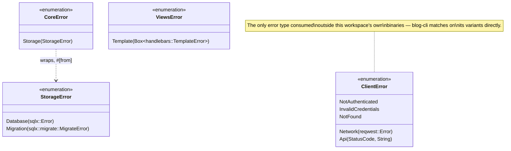
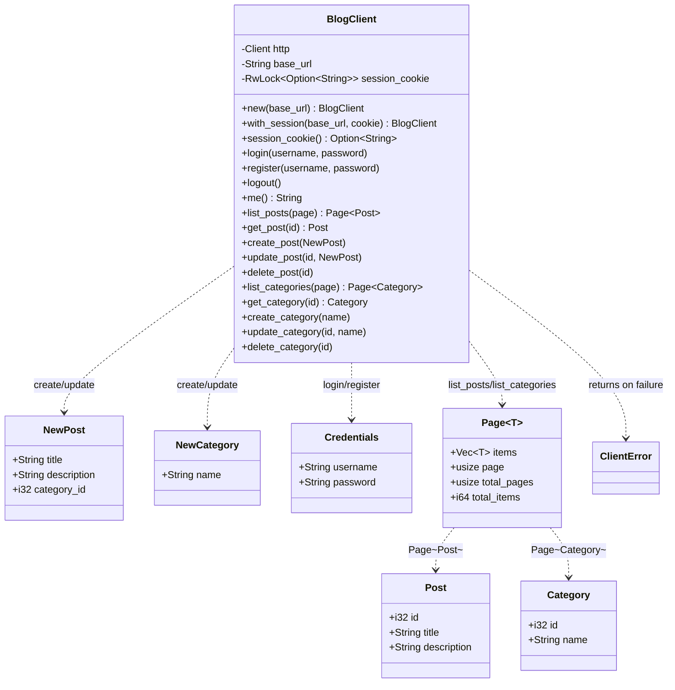

# Data Model

UML-style class diagrams of this codebase's structs, enums, and traits — how they relate to each
other, not just what fields they have. For the architectural reasoning behind these
relationships, see [ARCHITECTURE.md](ARCHITECTURE.md); for the JSON shapes these types produce
over the wire, see [API.md](API.md).

Rust has no class inheritance, so these diagrams use UML's existing vocabulary for what Rust
actually has: a realization arrow (`..|>`) for "implements this trait," a dependency arrow (`..>`)
for "uses/returns this type," and a `<<trait>>`/`<<enumeration>>` stereotype where a `class` box
would otherwise be misleading.

## Table of contents

1. [Domain types & repository ports](#domain-types--repository-ports)
2. [Error type hierarchy](#error-type-hierarchy)
3. [Client-side wire types](#client-side-wire-types)

## Domain types & repository ports

The core data shapes (`blog-storage::domain`), the three ports that operate on them
(`blog-storage::ports`), and their two concrete implementations — chosen at compile time via
Cargo feature, never both present in one binary (see
[ARCHITECTURE.md § Database backend strategy](ARCHITECTURE.md#database-backend-strategy)).

```mermaid
classDiagram
    class Post {
        +i32 id
        +String title
        +String description
    }
    class PostWithCategory {
        +i32 id
        +String title
        +String description
        +String name
    }
    class NewPost {
        +String title
        +String description
        +i32 category_id
    }
    class Category {
        +i32 id
        +String name
    }
    class NewCategory {
        +String name
    }

    class PostRepository {
        <<trait>>
        +count() i64
        +count_for_category(i32) i64
        +page(i32, i64) Vec~Post~
        +page_for_category(i32, i32, i64) Vec~PostWithCategory~
        +find(i32) Vec~Post~
        +category_id_for_post(i32) i32
        +create(NewPost)
        +create_with_category(NewPost, i32)
        +update(i32, NewPost, i32)
        +update_without_category(i32, NewPost)
        +attach_category(i32, NewPost, i32)
        +delete(i32)
    }
    class CategoryRepository {
        <<trait>>
        +all() Vec~Category~
        +all_except(i32) Vec~Category~
        +page(i32, i32) Vec~Category~
        +find(i32) Vec~Category~
        +count() i64
        +create(String)
        +update(i32, String)
        +delete(i32)
    }
    class UserRepository {
        <<trait>>
        +register(String, String)
        +credentials_match(String, String) bool
    }

    class PgPostRepository {
        -Pool~Postgres~ pool
    }
    class SqlitePostRepository {
        -Pool~Sqlite~ pool
    }
    class PgCategoryRepository {
        -Pool~Postgres~ pool
    }
    class SqliteCategoryRepository {
        -Pool~Sqlite~ pool
    }
    class PgUserRepository {
        -Pool~Postgres~ pool
    }
    class SqliteUserRepository {
        -Pool~Sqlite~ pool
    }
    class InMemoryPostRepository {
        -Mutex~Vec~Post~~ posts
        -Mutex~Vec~(i32, i32)~~ links
    }
    class InMemoryCategoryRepository
    class InMemoryUserRepository

    PostRepository <|.. PgPostRepository : postgres feature
    PostRepository <|.. SqlitePostRepository : sqlite feature
    PostRepository <|.. InMemoryPostRepository : test-only fake
    CategoryRepository <|.. PgCategoryRepository
    CategoryRepository <|.. SqliteCategoryRepository
    CategoryRepository <|.. InMemoryCategoryRepository : test-only fake
    UserRepository <|.. PgUserRepository
    UserRepository <|.. SqliteUserRepository
    UserRepository <|.. InMemoryUserRepository : test-only fake

    PostRepository ..> Post : returns
    PostRepository ..> PostWithCategory : returns
    PostRepository ..> NewPost : accepts
    CategoryRepository ..> Category : returns
    CategoryRepository ..> NewCategory : name field accepted

    class AppState {
        +Posts posts
        +Categories categories
        +Users users
        +MagicCryptCipher cipher
    }
    AppState --> PostRepository : one concrete type, resolved by feature
    AppState --> CategoryRepository
    AppState --> UserRepository
```

`InMemoryPostRepository`/`InMemoryCategoryRepository`/`InMemoryUserRepository`
([`blog-core/src/test_fakes.rs`](blog-core/src/test_fakes.rs)) are a third implementation of the
same three traits, `#[cfg(test)]`-gated — they never exist in a release build. `AppState`
([`src/adapters/http/state.rs`](src/adapters/http/state.rs)) is where the abstraction actually
resolves: `Posts`/`Categories`/`Users` are type aliases pointing at either the `Pg*` or `Sqlite*`
struct depending on which Cargo feature was compiled in, never an enum over both.

## Error type hierarchy

Every library crate has its own error enum (`thiserror`); only `CoreError` wraps another crate's
error. See [ARCHITECTURE.md § Error handling strategy](ARCHITECTURE.md#error-handling-strategy)
for why `anyhow` isn't part of this picture at all.

`StorageError`, `ViewsError`, and `ClientError` are otherwise independent — they belong to crates
that don't depend on each other (`blog-storage`, `blog-views`, `blog-client`). `anyhow::Error`, used
only in `src/main.rs` and `blog-cli/src/main.rs`, isn't pictured here — it's a catch-all at the two
binaries' entry points, not a type any of these four ever construct or match on.

## Client-side wire types

`blog-client`'s own type definitions — independent of `blog-storage`'s domain types by design (the
JSON payload is the actual contract, not a shared Rust type — see
[API.md § Wire types](API.md#wire-types)) — and the typed client built around them.

`blog-cli`'s `commands.rs` is the only other consumer of these types in this workspace — it holds
no state of its own beyond the session cookie ([`blog-cli/src/session.rs`](blog-cli/src/session.rs)),
formatting whatever `BlogClient` returns directly to stdout.
